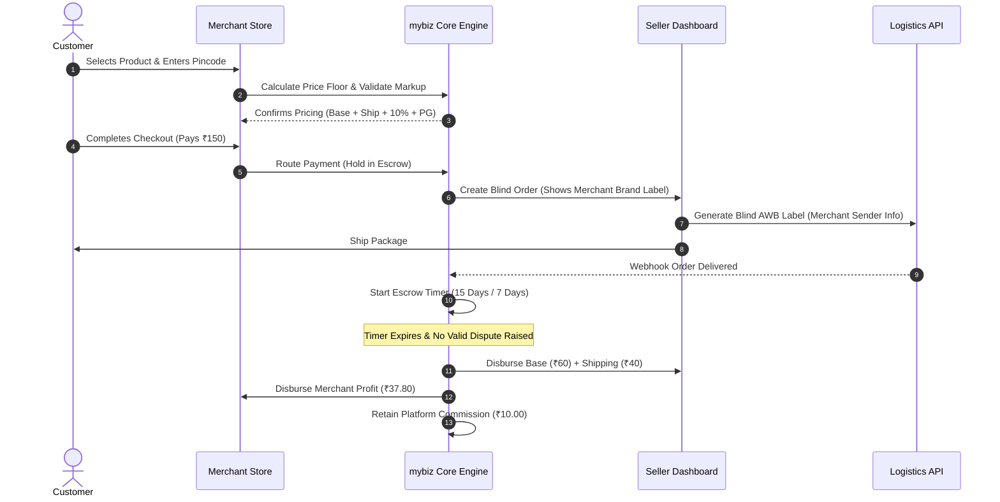

# Business Plan & Product Features Specification: "mybiz"
## Next-Gen B2B2C White-Labeled Dropshipping & Supply Engine

---

## 1. Executive Summary

### 1.1 Objective & Vision
**mybiz** is a B2B2C e-commerce platform designed to democratize digital commerce in emerging markets. It bridges two primary economic groups:
1. **Suppliers / Manufacturers (Sellers)** who possess inventory and manufacturing capabilities but lack direct-to-consumer (D2C) marketing expertise and digital reach.
2. **Micro-Entrepreneurs / Students / Influencers (Merchants)** who have social traffic, digital marketing capacity, or niche communities but zero capital for inventory.

By providing **turnkey, white-labeled storefronts**, **automated price-floor margin calculations**, **blind dropshipping logistics**, and **escrow-backed financial settlements**, **mybiz** eliminates risk for both sides:
- **Sellers** get a zero-CAC (Customer Acquisition Cost) distribution network.
- **Merchants** launch zero-inventory, fully-branded e-commerce brands in under 5 minutes.
- **End Customers** receive high-quality products under independent merchant brands with reliable fulfillment.

---

## 2. Business Model & Financial Architecture

### 2.1 Unit Economics & Pricing Margin Algorithm

To make the business model **foolproof**, the platform enforces an immutable **Absolute Price Floor** system upon product import. A merchant *cannot* list a product below this threshold under any circumstances.

#### Math & Formula Structure:
$$\text{Price Floor} = \frac{\text{Base Price} + \text{Shipping Fee} + \text{Platform Commission (10\%)}}{1 - \text{PG Fee Rate (2\%)}}$$

For a representative product:
| Component | Formula / Source | Example Value | Recipient |
| :--- | :--- | :--- | :--- |
| **Seller Base Price** | Set by Seller | ₹60.00 | Seller |
| **Flat-rate Shipping** | Set by Seller tier (Pincode distance) | ₹40.00 | Seller / Logistics Partner |
| **Subtotal (Base + Shipping)** | Base + Shipping | ₹100.00 | - |
| **Platform Commission** | 10% of Subtotal | ₹10.00 | Platform Revenue |
| **Subtotal after Commission** | ₹100 + ₹10 | ₹110.00 | - |
| **PG Fee Engine** | ~2% of Final Customer Total | ₹2.20 | Razorpay / Cashfree |
| **Absolute Price Floor** | Minimum permissible sale price | **₹112.20** | Enforced Minimum |
| **Merchant Selling Price** | Configured by Merchant (Markup) | **₹150.00** | Customer Pays |
| **Merchant Net Profit** | Selling Price - Price Floor | **₹37.80** | Merchant Wallet (Escrowed) |

---

### 2.2 Revenue Streams for Platform (mybiz)

```
                       ┌─────────────────────────────────────────┐
                       │           mybiz Platform Monetization   │
                       └───────────────────┬─────────────────────┘
                                           │
         ┌───────────────────┬─────────────┴───────┬───────────────────┐
         ▼                   ▼                     ▼                   ▼
┌──────────────────┐┌──────────────────┐┌──────────────────┐┌──────────────────┐
│  10% Commission  ││  SaaS Tiers for  ││ RTO / COD Risk   ││ Seller Promotion │
│   per Order      ││  Merchants       ││ Protection Surcharge│ Featured Catalogs│
└──────────────────┘└──────────────────┘└──────────────────┘└──────────────────┘
```

1. **Transaction Commission (Core)**: 10% on every order base + shipping subtotal.
2. **Merchant SaaS Subscriptions**:
   - **Free Plan (Starter)**: Subdomain (`store.mybiz.com`), max 25 catalog imports, 15-day settlement.
   - **Pro Plan (₹499/mo)**: Custom Domain CNAME mapping, unlimited imports, priority payouts, abandoned cart recovery tooling.
   - **Elite Plan (₹1,499/mo)**: Custom branding kit, dedicated account manager, automated social ad templates, 7-day settlement accelerator.
3. **Payment Gateway Surcharge Margin**: Standard PG cost is ~1.5% - 1.8%, while the platform budgets 2.0%, retaining the microscopic spread on high volume.
4. **Seller Promoted Listings**: Sellers pay for boosted placement in the Merchant Catalog search engine.

---

### 2.3 Financial Risk Mitigation: Escrow & RTO Management

#### Escrow Tier Matrix
To prevent supplier fraud and non-delivery, all funds pass through a automated Escrow Engine:

```mermaid
graph TD
    A[Customer Pays Order] --> B[Escrow Wallet Held]
    B --> C[Order Delivered & Verified]
    C --> D{Merchant Tier?}
    D -- Tier 1: Months 1-3 --► E[Hold for 15 Days Post-Delivery]
    D -- Tier 2: Month 4+ Trusted --► F[Hold for 7 Days Post-Delivery]
    E --> G[Payout Disbursed to Seller & Merchant]
    F --> G
```

#### Cash on Delivery (COD) & Return to Origin (RTO) Mitigation Strategy
Dropshipping in India & emerging markets carries a high RTO (Return to Origin) risk on Cash-on-Delivery. 
**Foolproof Counter-Measures:**
1. **Pre-Call Verification Bot**: Automated WhatsApp / IVR confirmation before order dispatch.
2. **Merchant RTO Reserve Deposit**: Merchants on free tiers must maintain a minimum buffer wallet (e.g., ₹500) to cover potential reverse logistics fees if COD is enabled.
3. **Prepaid Discount Incentives**: Automatic ₹20 discount at checkout if customer opts for UPI / Card over COD.

---

## 3. Product Features Specification (Exhaustive Matrix)

### 3.1 Super Admin Engine (Platform Operations)

```
+-------------------------------------------------------------------------------+
|                             SUPER ADMIN ENGINE                                |
+-----------------------+-----------------------+-------------------------------+
| Financial Ledger      | User Governance       | Dispute & Strike Engine       |
| - Escrow Holding Tank | - Seller KYC Verification| - Automated Defect Tracking |
| - Payout Batching     | - Merchant Approval   | - >3% Defect Auto-Disable     |
| - Commission Summary  | - Catalog Moderation  | - Evidence Review (Photo/Vid) |
+-----------------------+-----------------------+-------------------------------+
```

* **Master Financial Ledger**: Real-time visualization of Gross Merchandise Value (GMV), Platform Net Revenue, Escrow Holding Balance, and Pending Disbursals.
* **Seller KYC & Governance**: Automated Aadhaar/GSTIN validation, bank account penny-drop verification, and warehouse address inspection.
* **Catalog Approval Pipeline**: AI-assisted + manual review of incoming products to ensure compliance, non-infringement, and realistic base pricing.
* **Seller Defect Strike Engine**:
  - Automatically calculates `Defect Rate = (Wrong/Damaged Tickets / Total Delivered Orders) * 100`.
  - **Threshold**: If Defect Rate exceeds 3% over a rolling 30-day window:
    1. System automatically locks all active product listings for that seller.
    2. Freeze seller wallet pending manual dispute audit.
    3. Issue formal warning or platform ban.
* **Subscription & Feature Gate Manager**: Dynamically control feature access per merchant plan (e.g., enable custom CSS or CNAME routing).

---

### 3.2 Seller Panel (Supply Side)

* **Product & Variant Catalog (CRUD)**:
  - SKU management with matrix variants (Size, Color, Material).
  - Stock quantity syncing with real-time stock reservation locks during checkout.
  - Bulk CSV/Excel product importer with image zip uploader.
* **Multi-Tier Shipping Configurator**:
  - Base warehouse Pincode configuration.
  - 3-Zone Flat Rate Matrix:
    1. **Zone A**: Intra-District (e.g., ₹30)
    2. **Zone B**: Intra-State (e.g., ₹50)
    3. **Zone C**: Rest of Country (e.g., ₹80)
* **Blind Fulfillment & Dynamic AWB System**:
  - Orders view hide end-customer phone numbers (masked/virtual number) to prevent off-platform poaching.
  - **Auto-Generated Shipping Label (AWB PDF)**:
    - **Sender Name**: Merchant's Brand Name (e.g., *"UrbanStyle Store"*)
    - **Sender Address**: Blind Return Hub / Merchant Virtual Address
    - **Original Supplier Name**: 100% hidden.
* **Seller Financial Desk**: Detailed log of cleared vs. escrow-locked funds per order ID, downloadable tax reports (TCS/TDS).

---

### 3.3 Merchant Panel (Demand Side)

* **No-Code Storefront Builder**:
  - **Domain Setup**: Instant allocation of `[merchant].mybiz.store` or 1-click Custom Domain integration via DNS CNAME pointing.
  - **Visual Editor**: Color palette selector, banner upload, top bar announcements, and featured collection layouts.
  - **Brand Assets**: Custom Logo, Favicon, Social links, and custom About Us text.
* **Supplier Marketplace & 1-Click Import**:
  - Searchable catalog of pre-vetted supplier products with wholesale prices shown.
  - 1-Click "Add to My Store" modal with margin preview.
* **Smart Markup Engine**:
  - Allows bulk rule setting (e.g., *"Add 30% profit markup to all apparel"*).
  - Real-time client-side and server-side validation against the **Absolute Price Floor**. Input field physically blocks prices below floor.
* **Order & Customer Management**:
  - Track order lifecycle (Unfulfilled, In-Transit, Delivered, Disputed).
  - Direct ticket escalation portal to Super Admin with customer uploaded media.
* **Payout & Analytics Dashboard**:
  - Countdown clock showing exact date/time when escrowed profits unlock for payout to bank account via UPI/NEFT.

---

### 3.4 Customer Storefront & Experience

* **Ultra-Fast White-Label Frontend**:
  - Built with responsive, modern UI design principles. Zero mention of "mybiz" or original suppliers anywhere in footers, checkout, emails, or SMS notifications.
* **Dynamic Shipping & Delivery Time Calculator**:
  - At product page or checkout, customer enters destination Pincode.
  - System silently cross-checks against hidden Seller origin Pincode to compute exact tier shipping rate and estimated delivery date (EDD).
* **Self-Service Order Tracking Portal**:
  - Customer can enter Order ID + Mobile number to view real-time tracking milestones (Picked up, In-Transit, Out for Delivery).
* **Strict "Wrong/Damaged" Resolution Portal**:
  - No standard "change of mind" returns allowed (enforced in Store T&C).
  - Dispute submission requires:
    1. Unboxing video link or upload.
    2. High-resolution photo of shipping label + defective item.
    3. Mandatory reason selection ("Wrong Item Received" or "Damaged on Arrival").

---

## 4. Platform Data Flow & Architecture



---

## 5. Go-To-Market (GTM) Strategy & Execution Roadmap

### 5.1 Merchant Acquisition Strategy (Campus & Micro-Influencers)
* **Campus Ambassador Program**: Onboard college students as merchants by pitching it as a "Zero-Investment Startup".
* **Influencer Monetization Package**: Target micro-influencers (1k–50k followers) on Instagram/YouTube who want to sell merch/products without inventory risk.
* **Free Training Academy**: Provide step-by-step videos on setting up stores, running meta ads, and organic social marketing.

### 5.2 Seller Acquisition Strategy
* Direct outreach to manufacturing clusters (e.g., Surat for textiles, Ludhiana for knitwear, Agra for footwear).
* Pitch: *"Access 10,000 active digital salespeople without spending a single rupee on ads."*

---

## 6. Implementation Roadmap

```
Phase 1: Core Engine (Weeks 1-4)
├── Database Schema Design (Multi-tenant)
├── Super Admin Engine & Financial Ledger
├── Price Floor Engine & Escrow System
└── Seller Panel & Product CRUD

Phase 2: Merchant & Storefront Engine (Weeks 5-8)
├── Subdomain Routing Engine (*.mybiz.store)
├── Storefront Builder & Theme System
├── Product Import & Markup Validator
└── Payment Gateway & Escrow Integration

Phase 3: Logistics & Dispute System (Weeks 9-10)
├── Blind AWB Label Generation Engine
├── Dynamic Pincode Distance/Shipping Calculator
└── Wrong/Damaged Media Dispute Portal

Phase 4: Polish & Scale (Weeks 11-12)
├── Custom Domain CNAME Routing
├── Automated Seller Defect Strike Engine
├── Pre-call WhatsApp Verification Bot
└── Security & Performance Optimization
```

---
*Document Version: 1.0.0 | Project: mybiz | Authored for: softwavehub*
